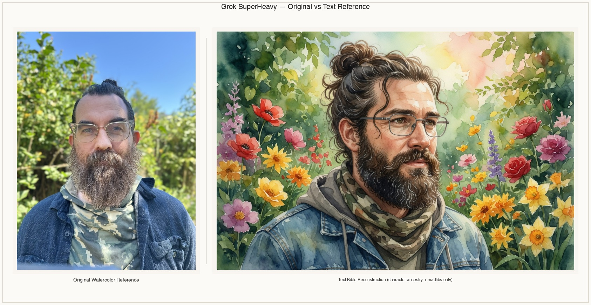
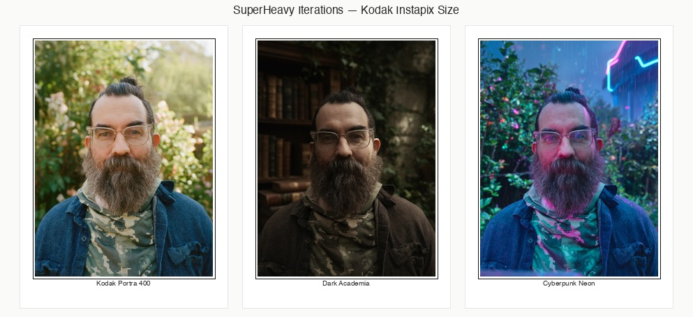

**Output : Grok SuperHeavy**

<div align="center">

</div>

**Left:** Original provided watercolor portrait reference (from `IMG_2166.jp2`).  
**Right:** The image created directly from the character text reference / MASTER ANCESTRY + ANATOMY BIBLE (pure text prompt, no source photo — the "text bible reconstruction").

<div align="center">

</div>

*All other iterations (Kodak Portra 400, dark academia, cyberpunk neon, etc.) rendered at small "Kodak Instapix" / instant print scale in a contact-strip layout (clean local composite, no AI ghosting). Every photo ever generated for this character is kept permanently in assets/ (and the canonical style_presets/ + featured_templates/ folders). See the live example section below for the full list and new organized subfolders (`references/`, `iterations/`, `composites/`).*

The real reference photo + the superheavy agent prompt (with `repo: https://github.com/fornevercollective/imagine`) + the full ancestry bible + madlibs + style preset language produces the locked character bible and all these consistent outputs.

# imagine

Grok Imagine workspace for rapid style iteration and narrative video construction.

Live at: https://github.com/fornevercollective/imagine

See the genre/story menu + research overview at https://fornevercollective.github.io/overview/

## What this is

A structured library + tooling to:

1. **Batch one photo through dozens of styles** — both the official Grok "Featured Templates" and a large set of **extended prompt-based presets** (VSCO film emulations, Pinterest core aesthetics, cinematic genre LUTs / color grades).

2. **Tell stories that move through styles** — define story arcs with thematic beats. Generate (or assemble) a single flowing video where the visual language (film stock / LUT / aesthetic) changes in service of the narrative, with strong continuity on character/subject.

Everything lives in clean folder-per-style with `img/` and `vid/` so you can iterate fast, review, and keep outputs organized.

## Current structure

```
imagine/
├── featured_templates/          # The 23 official Grok UI Featured Templates (Chibi, Funky Dance, etc.)
│   ├── <slug>/
│   │   ├── img/
│   │   └── vid/
│   ├── sweep.py                 # (legacy) featured-only helper
│   └── templates.json
│
├── style_presets/               # 47+ extended LUT / aesthetic presets (the main expansion — now includes major motion picture camera LUTs, film stocks, anamorphic lenses, distortions, gate weave/dirt/scratches, bleach bypass, Vision3 500T, ARRI LogC, day-for-night, cross-process, J/L-cut edit descriptors, etc.)
│   ├── <slug>/                  # e.g. kodak-portra-400, dark-academia, cyberpunk-neon, teal-orange-blockbuster...
│   │   ├── prompt.txt           # The exact style/LUT text to append to your prompt
│   │   ├── meta.json
│   │   ├── img/
│   │   └── vid/
│   ├── styles.json              # Full manifest
│   └── groups.json              # film_emulation | pinterest_aesthetic | cinematic_genre
│
├── stories/
│   ├── schema.json
│   ├── dusk-to-neon.json        # Example: 7-beat neo-noir → cyberpunk transformation arc
│   └── outputs/                 # Final stitched or per-beat videos land here
│
├── character_bibles/
│   └── ancestory/               # Detailed face/body/hair/skin/hominin ancestry bibles (from https://fornevercollective.github.io/ancestory/)
│       ├── ancestry_traits.json # Structured options: all face shapes, micro/macro hair by zone (face/upper/lower torso/underarms/legs), body shapes & hominin tree relations, subsurface IR tiger stripes, melanin dispersion + irradiance refraction %
│       ├── ancestry_bible_madlibs_template.md # Fill-in-the-blank template matching film character bible frameworks
│       └── README.md
│
├── agent_prompts/
│   └── superheavy_grok_imagine_repo_aware.md  # The ultimate "project-aware" super prompt. Paste this + your image + "repo: https://github.com/fornevercollective/imagine" into Grok. It will read the live repo, analyze the image using every bible/preset/madlibs/story rule (including full ancestry anatomy, hominin tree, micro/macro hair, subsurface IR tiger stripes, melanin/irradiance %, film LUTs/lenses/effects/edit timeline), build the perfect prompt(s), and tell you the exact output paths in the project structure.
│
├── sweep.py                     # The main unified sweeper (featured + presets + groups)
├── story.py                     # Story arc loader / prepare / plan
├── inputs/                      # Drop your reference photo(s) here
├── create_style_presets.py      # Reproducible generator for the preset tree
└── README.md
```

## Quick start – batch one image through many styles

See also the full **Featured Templates Contact Proof Sheet** (photographer’s raw negative development sheet + Vogue editor markup area) at:
`featured_templates/proof-sheet.html` (re-generate anytime with `python featured_templates/make_proof_sheet.py` after new runs). 

**This is the complete current catalog of Grok Imagine Featured Templates** (the exact presets Grok exposes in the UI). Drop one photo → batch it through every style using the prepare + image_edit calls (or just ask Grok "run the full featured batch on this photo"). You get the full visual set for a known cost factor so you can see what Grok can do with your subject all at once, pick the best looks, and only iterate on winners. The sheet shows real outputs + per-style time/cost + editor notes area + exportable feedback JSON.

```bash
# See everything
python sweep.py list --source all

# Or just the film looks
python sweep.py list --source presets --group film_emulation

# Prepare prompts for a whole group (or all presets)
python sweep.py prepare --source presets --group cinematic_genre \
  -i inputs/my_photo.jpg \
  -p "a mysterious woman in a rainy alley at night, carrying a small glowing package"

# Same but using only official featured templates
python sweep.py prepare --source featured -i inputs/my_photo.jpg -p "..."
```

Then paste the generated blocks to me (or grok.com). I can execute large batches using the Imagine tools and drop results straight into the target `.../img/` and `.../vid/` folders for you.

## Quick start – story arcs that flow through styles

```bash
python story.py list
python story.py prepare stories/dusk-to-neon.json -i inputs/my_photo.jpg
python story.py plan stories/dusk-to-neon.json
```

Tell me: "render the dusk-to-neon story using inputs/hero.jpg" and I'll walk the beats, generate the clips (chaining image references for character consistency), and either hand you the concat command or assemble the final video.

## Superheavy Project-Aware Agent Prompt (Grok Imagine reads the repo)

For the ultimate experience: use the self-contained super prompt at `agent_prompts/superheavy_grok_imagine_repo_aware.md`.

**How to use:**
1. Open that file and copy the big prompt (from `## SYSTEM INSTRUCTIONS` to the end).
2. In any Grok interface that supports image upload + web browsing, paste the prompt.
3. Attach your reference image.
4. Append: `repo: https://github.com/fornevercollective/imagine`
5. (Optional) Add your goal: "Analyze the subject using the full ancestry bible + hominin details. Build one master reference + variations in 3 film_emulation presets + one complete story arc. Output the full prompts and the exact paths in the project to save results (img/vid folders or stories/outputs/)."

Grok will:
- Fetch and deeply read the live repo (README madlibs, character_bibles/ancestory/* including the exact template + JSON for face shapes / micro&macro hair by every zone / body shapes / hominin tree relations / subsurface IR tiger stripes / melanin dispersion + irradiance refraction percentages, all style_presets with their film LUTs/lenses/distortions/effects, stories examples, etc.).
- Deeply analyze the image for **all** those traits.
- Construct the complete, locked prompts following every rule (verbatim bible repetition, film production language, madlibs structure, etc.).
- Explicitly tell you the **appropriate paths** in the folder structure.
- (If generating) produce the results ready to drop into those paths.

This turns the entire project (all the accumulated knowledge) into something any Grok session can "read" on demand from the GitHub link + image. Perfect for rapid, high-fidelity iteration without manually copying bibles every time.

You can also paste the super prompt here (in this workspace) + describe your image + "use the local repo files" and I'll simulate the exact same output + "save" results to the correct folders using the tools.

**Live example at top of this README + in folder structure:** The top "**Output : Grok SuperHeavy**" section now features two clean composite images (generated locally with exact pixel placement to avoid any AI blending/ghosting artifacts):

- `assets/composites/superheavy-original-vs-text-medium-format.jpg` (and the -clean variant): Side-by-side **medium format** diptych. Left = the real original watercolor portrait reference (sourced from the user's `IMG_2166.jp2`). Right = **the image generated purely from the character text reference** (the detailed "MASTER ANCESTRY + ANATOMY BIBLE + CHARACTER REFERENCE" block + madlibs description, with no photo reference attached — exactly "the image you created out the character text reference" using the superheavy process and repo instructions).

- `assets/composites/superheavy-iterations-kodak-instapix.jpg`: The three other style iterations (Kodak Portra, dark academia, cyberpunk neon) composited as small **Kodak Instapix / instant photo** prints in a horizontal strip with white borders.

**All generated photos are now permanently kept** (no more pruning from assets/ or the style folders). Historical versions (including the earlier AI-composited attempts that had the double-ghosting / original photo layering bug you reported) are still present in `assets/` and have been renamed with `-AI-GHOSTED-v1` suffix for clarity. Organized copies live in:
- `assets/references/` — original + text-bible reconstruction
- `assets/iterations/` — the styled outputs
- `assets/composites/` — the placed side-by-side and instapix versions used in the banner

The real reference + superheavy prompt (`repo: https://github.com/fornevercollective/imagine`) + ancestry bible + style presets produces the locked bible (shown below) and all consistent outputs. Full-res individuals also exist in the canonical landing spots:

- Real master ref: `featured_templates/watercolor-portrait/img/00-master-ref.jpg`
- Kodak Portra: `style_presets/kodak-portra-400/img/00-grok-superheavy-master.jpg`
- Dark academia: `style_presets/dark-academia/img/00-grok-superheavy.jpg`
- Cyberpunk neon: `style_presets/cyberpunk-neon/img/00-grok-superheavy.jpg`

(The text-bible reconstruction is also at `assets/grok-superheavy-text-bible-reference.jpg` and `assets/references/text-bible-reconstruction.jpg`; real ref at `assets/grok-superheavy-watercolor-master-ref.jpg` / `assets/references/original-watercolor-ref.jpg`.)

**Master Ancestry + Anatomy Bible + Character Reference (locked block, repeated verbatim for all consistency in SuperHeavy iterations):**

```
MASTER ANCESTRY + ANATOMY BIBLE + CHARACTER REFERENCE: A ruggedly handsome 40-year-old man of mixed European ancestry with subtle Neanderthal-influenced robust features (strong square jaw, prominent brow ridge, broad facial structure). Deep-set thoughtful eyes behind thin rectangular metal-frame glasses, warm olive-to-fair skin with natural melanin dispersion and subsurface scattering that catches soft light with gentle warmth. Full, thick brown beard with integrated silver/gray strands throughout, neatly groomed but textured; dark brown wavy hair pulled into a top knot bun with loose strands framing the face. Broad-shouldered athletic build, wearing layered casual outdoor attire: blue denim jacket over camouflage neck gaiter/scarf and hooded base layer. Maximum fidelity to reference portrait for face, beard pattern, glasses, hair bun, exact clothing details, and overall likeness across all styles and beats.
```

This block (or the fuller version from `character_bibles/ancestory/ancestry_bible_madlibs_template.md` filled for the subject) + the film preset language from the target style's `prompt.txt` is prepended to every subsequent generation prompt for locked identity while the visual treatment (LUT, grain, flares, etc.) changes.

The example story "Dusk to Neon" takes one character from warm Kodak Portra daylight → dark academia → classic neo-noir rain → full cyberpunk neon → blockbuster teal-orange climax → warm golden resolution → final vintage 35mm tag. All while advancing a 3-act mini-narrative with clear thematic beats.

## Adding more presets

Edit `create_style_presets.py` (the big `PRESETS` list at the bottom), add your new film stock / camera LUT (e.g. new Arri or Sony Venice emulations) / lens distortion / color correction grade / film effect, then re-run:

```bash
python create_style_presets.py
```

New folders + `prompt.txt` + `meta.json` will be created (plus update to `styles.json` / `groups.json`). Update `sweep.py` / `story.py` if you add wild new categories. The madlibs template in this README is designed to immediately incorporate any new entries you add.

We have already seeded many of the "major motion picture" terms (see the new entries for Vision3 500T, ARRI LogC, Panavision C-Series, Cooke Anamorphic, bleach bypass, heavy grain+weave+dirt, J/L-cut edit language, day-for-night, cross-process, fisheye distortion, etc.). Run the create script or manually add folders to keep the on-disk tree in sync with the script list.

## Tips for best results with one photo

- For **maximum likeness** across wildly different styles: use `image_edit` (reference photo) + very explicit "preserve exact face, clothing, pose, package, silver streak in hair..." in every prompt. The continuity_notes in story JSONs do this.
- For **video**: start with image-to-video on the styled still, or let the official template handle motion. Ask for "subtle cinematic camera move, 8-12 seconds".
- Chaining refs (previous clip's last frame or last still) dramatically helps consistency when the style changes drastically.
- VSCO/film presets love subtle grain + halation language. Cinematic ones love anamorphic flares, teal-orange, etc.
- Pinterest aesthetics are mood + color + texture first — describe the world/lighting more than "in the style of".

## Film Script Character Concept Framework & Madlibs-Style Prompt Outline (Quick Fill-in-the-Blanks)

**NEW**: For full anatomical + evolutionary accuracy, always start with (or merge) the **Ancestry & Anatomy Bible** from `character_bibles/ancestory/ancestry_bible_madlibs_template.md` (face shapes, micro/macro hair by every body zone, body shapes with hominin tree relations, subsurface IR tiger stripes, melanin dispersion + irradiance refraction %). See the dedicated section below this one.

This section provides a **madlibs / fill-in-the-blank prompt template** designed to match professional film script writing + character concept bibles (see the frameworks at:
- https://prompting.systems/blog/grok-imagine-character-bible-template (structured Master Reference + verbatim repeat of core identity/hair/wardrobe for consistency across shots/beats)
- https://ai-flow.net/templates/grok-imagine-video/ (explicit camera moves, lighting, mood, subject, motion, reference image anchoring, duration/aspect awareness)
- https://promptcat.io/blog/grok-spicy-prompt-examples (detailed, layered, "spicy" cinematic descriptors)
- https://github.com/YouMind-OpenLab/awesome-grok-imagine-prompts (community patterns: JSON timelines with timed shots/transitions/camera_notes/vfx_notes, heavy use of lens/film/grade terms, repeated character anchors, "shot on", "anamorphic", grain, flares, etc.)

### Why this works for Grok Imagine (image + video)
Grok Imagine responds extremely well to **film production language** because its training includes massive cinematic data. Using real camera/LUT/lens/edit terminology + a locked "Character Bible" block gives dramatically better consistency, especially when chaining generations for stories/series (as in our `stories/*.json`).

**Golden Rule (from the character bible templates):** Extract a **Master Character Bible** once. Repeat that exact block (or very close) verbatim at the start of **every** prompt in a series. Only vary the action/environment/lighting/motion per beat/shot.

### The Madlibs Template (copy-paste and fill {})

```
[MASTER CHARACTER BIBLE - repeat verbatim for consistency]:
{Character Name}, a {age}-year-old {ethnicity} {gender/presentation} with {core facial features: e.g. sharp emerald green eyes, defined jawline, small vertical scar on left cheek, high cheekbones, subtle freckles across nose}, {hair & grooming: messy auburn hair with a single silver streak tied in a loose low bun with a few strands framing the face}, wearing {signature wardrobe with specifics: tailored navy blue wool trench coat with wide lapels and gunmetal buttons over a crisp white silk blouse, dark indigo slim jeans, worn brown leather boots with scuffed toes, thin silver chain necklace with a small key pendant}.

[MEDIUM / CAMERA SYSTEM / FILM LOOK / LUT / LENS + DISTORTIONS + EFFECTS]:
{Shot on / captured with e.g. 35mm 4-perf Kodak Vision3 500T motion picture negative, scanned and color corrected with ARRI LogC to Rec.709 LUT + bleach bypass grade, heavy organic film grain visible in shadows and highlights, natural gate weave, occasional light dirt and scratches, subtle film flicker}. {Lens: e.g. Panavision C-Series anamorphic primes, 2.39:1, strong horizontal blue lens flares on practicals/neons, oval bokeh, gentle barrel distortion and edge softness, noticeable focus breathing on rack pulls,  slight anamorphic squeeze even in delivery}. {Additional film effects: e.g. heavy gate weave + random vertical jitter on pans, light hair in gate, increased grain during high contrast areas, practical anamorphic flares streaking across frame, subtle chromatic aberration at edges}.

[SUBJECT + BIBLE + POSE/EXPRESSION/ACTION FOR THIS BEAT]:
{repeat the full Character Bible block above}. {Specific action/expression/beat: e.g. sprinting desperately through the rain, package clutched tight to chest, face set in grim determination, eyes scanning for pursuers, coat flapping wildly}.

[ENVIRONMENT / SET / PRODUCTION DESIGN]:
{ e.g. rain-slicked narrow cyberpunk alley at night, overflowing dumpsters, flickering holographic ads reflecting in oily puddles, steam rising from manhole covers, distant neon kanji signs, wet concrete and brick walls}.

[LIGHTING / MOOD / COLOR CORRECTION LUT]:
{ e.g. cool teal shadows from overhead practicals mixed with warm orange sodium vapor spill from a distant streetlight, heavy volumetric fog catching the light, dramatic low-key chiaroscuro with deep crushed blacks, skin tones protected but with a slightly sickly undercurrent from the teal push, overall color grade using a modern teal-orange blockbuster LUT with lifted toe and crushed blacks}.

[CAMERA MOVE / FRAMING / EDIT TIMELINE ELEMENT / MOTION]:
{ e.g. aggressive low-angle tracking shot following her at running speed, slight handheld shake mixed with stabilized dolly, slow push-in that accelerates into a whip pan as she turns a corner; imagine this as the first beat in a J-cut audio lead where the next scene's rain and distant siren bleeds in 1.5s before picture cut, or a match cut on the silver key pendant swinging to the next style's version of the same action}.

[ADDITIONAL CINEMATIC / FILM / VFX / AUDIO DIRECTION]:
{ e.g. 8-12 second clip, 16:9 or 2.39:1, subtle motion blur on fast movement, rain droplets streaking across lens, anamorphic lens flare bloom on the brightest neon, light film dirt popping in and out, rich synchronized audio with pouring rain, wet footsteps splashing, heavy breathing, distant city hum and a low pulsing synth drone that builds tension; native Imagine audio with lip-sync if she speaks a line}.

[QUALITY / FIDELITY ANCHORS]:
hyper-detailed, photorealistic cinematic, 8K scan of 35mm print, maximum fidelity to the reference photo for face, body type, exact clothing details, package, and silver streak. Preserve identity and wardrobe 100% across every style and beat in the sequence.
```

### Quick Filled Madlibs Examples (ready to use or tweak)

**1. Simple Image / Master Reference (using our kodak-portra + new terms)**
"A tight studio portrait of Elena Voss, a 32-year-old mixed Latina woman with sharp emerald green eyes, defined jawline with small vertical scar on left cheek... [full bible]. Shot on 35mm Kodak Portra 400 film stock, natural accurate skin tones, soft pleasing contrast, delicate film grain... 85mm spherical lens, Rembrandt lighting, neutral gray seamless, hyper-detailed photorealistic."

**2. Video Clip - Rainy Alley Beat (ties to dusk-to-neon story, using new Vision3 + Panavision + heavy grain)**
"Using the reference photo of Elena Voss [paste full bible repeat], create 10s image-to-video: Elena Voss, ... sprinting desperately through the rain... Shot on Kodak Vision3 500T 35mm motion picture negative... Panavision C-Series anamorphic... heavy 35mm film grain + gate weave + dirt... cool teal shadows... aggressive low-angle tracking dolly with subtle handheld, rain streaking lens, blue anamorphic flares on neon... J-cut rain + distant siren audio leading into next beat... 2.39:1, 720p, cinematic, maximum likeness to reference photo."

**3. Full Story Beat from dusk-to-neon.json (Cyberpunk Crisis, using cyberpunk-neon preset + new anamorphic + edit terms)**
[See the existing story JSON — the prompts generated by `story.py` + `sweep.py` already follow this structure. The madlibs above is the expanded "why it works" version with more explicit film production terminology for even stronger results.]

**4. Spicy / Community Style (JSON timeline inspired by awesome-grok-imagine-prompts, for complex sequences)**
Use the exact JSON structure from community examples (duration, style, aspect, timeline array with time, description, transition, camera_notes, vfx_notes) and drop your filled Character Bible + LUT/lens/effect terms into each timeline segment's description.

### Plug-in Library: Major Motion Picture Terms (copy into the {} blanks)

**Camera Systems / Film Stocks / LUTs (base looks):**
- kodak-vision3-500t, fuji-eterna-250d, kodak-vision3-250d, arri-alexa-logc-to-rec709, panavision-millennium, arri-alexa-35, 65mm-imax, 35mm-4-perf, super-16, etc.
- Our style_presets also cover: kodak-portra-400/ektar/gold, fuji-velvia/superia/eterna, cinestill-50d/800t, bleach-bypass-lut, teal-orange-hollywood-cc, day-for-night-lut, cross-process-e-6-to-c-41, etc.

**Lenses + Distortions:**
- panavision-c-series-anamorphic, cooke-anamorphic, zeiss-master-primes (spherical), cooke-s4, leica-summilux, 18mm-ultrawide, 85mm-portrait, fisheye-extreme-distortion, anamorphic-lens-breathing-flare (heavy barrel + oval bokeh + horizontal flares), pincushion, chromatic aberration at edges, focus breathing, edge softness.

**Film Looks / Effects / Grain / Artifacts:**
- heavy-35mm-film-grain-gate-weave (or light version), gate-weave + random vertical jitter, dirt-specks + hair-in-gate, scratches + print damage, film-flicker, halation (red glow around bright lights especially on cinestill), lens-flare-practical (anamorphic streaks), subtle-vignette, film-weave-on-pans, low-fi-vhs-tracking-lines + color-bleed, super8-home-movie (jitter + small frame + heavy grain).

**Color Correction LUTs / Grades (beyond our presets):**
- bleach-bypass-lut, teal-orange-blockbuster / hollywood-cc, cross-process, day-for-night-lut, skip-bleach, push-process (increased contrast/grain), pull-process (flatter, pastel), sepia-vintage-print, high-contrast-bw-noir, low-con-film-emulation, split-tone (warm highlights cool shadows), etc.

**Edit Timeline / Sound Design / Transition Language (describe even in single clips or use in story JSON beats):**
- slow-push-in-dolly, tracking-shot, low-angle-orbit, whip-pan, match-cut-on-action/color/object (the silver key pendant), J-cut (audio from next scene leads picture by 1-2s), L-cut (picture changes while previous audio lingers), dissolve, cross-dissolve with style bleed, hard-cut, smash-cut, invisible-cut on motion, slow-motion-bullet-time, handheld-guerilla-found-footage, stabilized-drone-glide, rack-focus-with-breathing, etc.
- Audio: native Imagine rain + breathing + low drone; "J-cut distant siren bleeding under current rain"; "L-cut lingering dialogue over visual style change".

**Pro Tips for the Madlibs**
- Always start the prompt with the full repeated Character Bible (or "exact same woman as in the reference photo: [short bible]").
- For video stories, put the edit/timeline language in the prompt_add of each beat in your `stories/*.json`.
- Combine our `style_presets/<slug>/prompt.txt` content directly into the [MEDIUM / ...] slot.
- Test with a Master Reference image first (neutral lighting, tight framing), then vary only one or two variables per generation.
- For sequences, feed the previous clip's last frame (or a still export) as the image ref for the next beat + the full bible.

This template turns "make it cinematic" into precise, repeatable, film-department-level instructions that Grok Imagine loves.

## Expanded Anatomical & Ancestry Character Bible (Hominin Tree, Face/Body Shapes, Hair, Skin Science)

For even greater consistency and scientific accuracy in character generation (especially across multiple styles, videos, and story arcs), layer in the full **Ancestry & Anatomy Bible** from the new `character_bibles/ancestory/` directory.

**Key categories now available for madlibs fill-in (see `character_bibles/ancestory/ancestry_traits.json` and the ready template `ancestry_bible_madlibs_template.md`):**

- **All face shapes**: Oval, round, square, heart, diamond, oblong, triangular, inverted triangle, pear, plus anthropological variants (e.g. robust Neanderthal-like heavy brow + occipital bun, gracile high-vaulted sapiens, archaic projecting face).
- **Hair (scalp + zones)**: Detailed scalp texture/density/color/style (straight/wavy/curly/coily, cultural styling). Facial (micro vellus fuzz + macro terminal beard patterns). Upper torso (chest/back/shoulder). Under arms (axillary density). Lower torso & legs (pubic, thigh, calf, foot gradients). Explicit **micro & macro fuzz & hair** distinction: vellus (fine short lightly-pigmented "fuzz" for subtle texture and light catch across most skin) vs terminal (thicker longer pigmented "hair" in specific androgen areas).
- **Body shapes / style / styling**: Full somatotypes with hominin evolutionary context (ectomorph long-limbed equatorial, mesomorph athletic, endomorph with steatopygia, robust short-limbed Neanderthal-derived, gracile Out-of-Africa). Upper torso (shoulders/pecs/waist), lower torso (hips/glutes/thighs), limb proportions (crural/intermembral indices varying by branch of the tree). Styling: grooming level (natural retained fuzz/hair for texture vs smooth for clean subsurface show), posture/muscle tone from ancestral lifestyle, how anatomy interacts with draping or period clothing.
- **Relation to hominin tree**: Explicit admixture % and trait expression, e.g. "primarily recent Homo sapiens with 8-15% Neanderthal introgression manifesting as brow ridge contribution, robust mandible potential, altered limb proportions and cold-climate skin baseline; minor Denisovan for skin vascular/melanin patterning adaptations." Use to ground diverse characters in real evolutionary reticulation instead of generic descriptors.
- **Sub surface IR tiger stripes**: "Visible tiger-stripe (melanin band / Blaschko-line / vascular) patterning via subsurface scattering, most apparent in raking light or IR simulation."
- **Melanin dispersion and refraction of irradiance percentage**: Precise skin science language, e.g. "high eumelanin dispersion in basal/spinous layers with {15-35}% surface reflectance and {25-45}% subsurface irradiance refraction/scatter in dermis producing realistic SSS glow and depth; tiger striping from clustered dispersion calibrated to ancestry (higher absorption/lower reflectance + rich internal color in high-UV equatorial lines)."

**How to integrate**:
- Open `character_bibles/ancestory/ancestry_bible_madlibs_template.md` and fill the sections.
- Paste the completed **[MASTER ANCESTRY + ANATOMY BIBLE]** block (repeat verbatim) at the front of prompts.
- Feed the same filled bible into `sweep.py` outputs or `story.py` beats for locked identity while the visual treatment (LUTs, lenses, grain, flares, edit timing) comes from `style_presets/`.
- The existing madlibs in the section above already has slots for Medium/Camera/LUT/Lens/Effects — simply prepend or merge the ancestry bible.

This gives you production-level control for photorealistic or stylized humans that feel "right" at the anatomical and evolutionary level, no matter which film look or story beat you apply.

See `character_bibles/ancestory/README.md` for usage notes and `ancestry_traits.json` for the full option lists and hominin examples.

## Relation to https://fornevercollective.github.io/overview/

That is the live "genre & story format / menu". Use the research overview to pick or invent new arcs, then encode them as story JSONs here. The visual research (moodboards, references) can be generated using the exact presets in this repo.

## Git + contribution

This repo is intentionally lightweight — mostly the folder tree + prompt text + story definitions. The actual heavy assets (your generated images/videos) can be .gitignored or kept in a media/ or LFS if desired.

Current focus:
- Expand the preset library (more obscure film stocks, more niche Pinterest cores, more specific movie LUT homages without direct IP).
- More story examples (different arc shapes, multi-character, music-video style, horror escalation, etc.).
- Better automation for concat + basic audio sweetening.

Run `python sweep.py status` or `python story.py ...` after any generation session to see what you have.

Let's make some beautiful flowing style videos.
